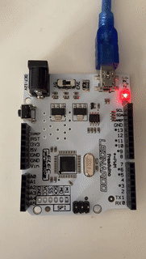
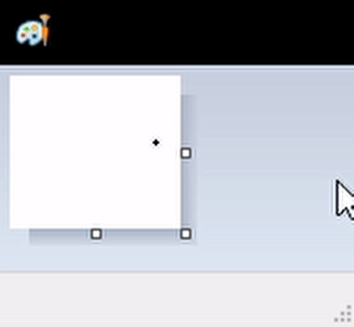

# Arduino Mouse Jiggler

This repository is my attempt to build a mouse cursor jiggling appliance for
preventing a Windows computer from locking.

## Why/when to choose this route? What are the alternatives?

- Turn off lock screen in Windows settings - unless group policy forbids it
- Use [Caffeine](https://www.zhornsoftware.co.uk/caffeine/) or
  [Mouse Jiggler](https://github.com/cerebrate/mousejiggler) to make Windows
  think keyboard/mouse is being used - unless Windows ignores virtual inputs
  (probably as a result of the same group policy) and locks itself anyway

## Software

There are several projects that implement other peripherials and translate them
to mouse inputs, for example:

[](https://www.youtube.com/watch?v=t8mE1ayw5bo)

They all use the [`Mouse.h`](https://www.arduino.cc/en/Reference.MouseKeyboard)
library that seems to come with the Arduino IDE. The
[`move`](https://www.arduino.cc/reference/en/language/functions/usb/mouse/mousemove/)
method in this library moves the mouse cursor relatively to its current position
making it ideal for a jiggler implementation.

```ino
#include <Mouse.h>

void setup() {
  Mouse.begin();
}

byte shift = 2;
byte wait = 250;
byte state;

void loop() {
  switch (state) {
    case 0: Mouse.move(shift, -shift, 0); break;
    case 1: Mouse.move(shift, shift, 0); break;
    case 2: Mouse.move(-shift, shift, 0); break;
    case 3: Mouse.move(-shift, -shift, 0); break;
  }

  state = (state + 1) % 4;
  delay(wait);
}
```

This code will move the mouse in a diagonal shape, staying around the origin and
not sliding off. The on-board RX/TX LEDs will indicate USB communication, so you
know the board runs and works.





## Hardware

According to the [`Mouse.h`](https://www.arduino.cc/en/Reference.MouseKeyboard)
documentation, [32u4 based boards](https://learn.adafruit.com/how-to-choose-a-microcontroller/next-step-32u4-boards)
and Due and Zero boards are supported:

> These core libraries allow a 32u4 based boards or Due and Zero board to appear
> as a native Mouse and/or Keyboard to a connected computer.

This means Micro and Micro Pro should work. It didn't for me. I tried:

- [Micro](https://store.arduino.cc/arduino-micro) - Windows USB driver did not
  find it
- [Pro Micro](https://www.sparkfun.com/products/12640) - Windows USB driver did
  not find it
- [Uno](https://store.arduino.cc/arduino-uno-rev3) - No support for USB HID
- [Leonardo](https://store.arduino.cc/arduino-leonardo-with-headers) - Worked!
  I actually had a Freeduino Leonardo, but to the Arduino IDE it's all the same

After flashing the program using the Arduino IDE, the board restarts and starts
acting as a mouse immediately. From this point on merely connecting it to the
computer will power it and make it act as a mouse until disconnected.

While having issues with the Windows USB driver not finding Micro and Micro Pro,
I also tried on macOS, but I was unable to flash it on macOS either. The bare
Arduino IDE install was not enough and I tried installing the driver recommended
by SparkFun: https://learn.sparkfun.com/tutorials/usb-serial-driver-quick-install-/all

But, this article points to an installer they host on their CDN and it is an old
version which is not signed by Apple and won't work on Catalina.

I found the up to date version on https://ftdichip.com/drivers/vcp-drivers. I
installed the signed-by-Apple latest version for macOS, but the Arduino IDE did
not show any USB serial ports anyway. I gave up trying to make it work on macOS,
but it probably would work for the Uno and the Leonardo, mimicking the issue on
Windows.

## Raspberry Pi

This same thing is possible to do on a Raspberry Pi, but it has no advantage
over using an Arduino. Maybe it would make sense with a Pi Pico? But that
board is fairly new so there are probably not many libraries for such stuff
for it.

https://github.com/stjeong/rasp_vusb

For the Pico specifically:

- https://github.com/iot-crazy/pi-pico-usb-joystick
- https://github.com/speedypotato/Pico-Game-Controller

## To-Do

### Try this out on the Pi Pico
